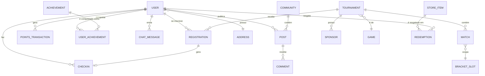

# PRD — AET Hub

**Status:** rascunho v1
**Dono do produto:** AET — Alegrete Esports Tournament

## 1. Contexto

A AET organiza eventos de jogos eletrônicos na cidade de Alegrete/RS. Hoje o
cadastro de players, a contagem de pontuação, a divulgação de campeonatos, o
checkin nos eventos e a organização das chaves são feitos de forma manual ou
fragmentada. O **AET Hub** centraliza tudo isso em uma plataforma única,
web e mobile-responsiva, com identidade visual retro-gamer e organização
moderna.

## 2. Objetivos do produto

1. Reduzir o tempo e o erro operacional no checkin e na montagem de chaves
   no dia do evento.
2. Dar aos players um lugar único para se inscrever, acompanhar sua
   trajetória (pontos, histórico, rivais) e se engajar com a comunidade
   entre um evento e outro (feed, chat, comunidades, gamificação).
3. Criar um incentivo de retenção via gamificação (níveis, achievements,
   loja de pontos) que mantenha os players ativos fora dos dias de evento.
4. Gerar dados confiáveis de pontuação e histórico para a AET usar em
   divulgação, patrocínio e planejamento de futuros eventos.

## 3. Personas / Atores

| Persona | Descrição | Necessidade principal |
|---|---|---|
| **Admin/Organizador** | Membro da equipe AET que cria e roda os torneios | Configurar torneio, fazer checkin rápido, manter a chave atualizada em tempo real |
| **Player** | Morador de Alegrete que participa dos torneios | Se inscrever, saber contra quem joga, acompanhar pontos/moedas, interagir com a comunidade |
| **Visitante (não autenticado)** | Alguém avaliando se quer se cadastrar | Ver próximos eventos e talvez o feed público antes de decidir se cadastrar |

## 4. Escopo

### Dentro do MVP
- Cadastro/autenticação por usuário (com validação de CEP de Alegrete)
- CRUD de torneios pelo admin, com definição de pontuação e formato de chave
- Checkin (manual por código + QR code)
- Chaveamento com atualização em tempo real (winners/losers bracket)
- Perfil de player com histórico, pontos e moedas
- Loja de pontos (itens cadastrados pelo admin, resgate pelo player)
- Feed principal com comentários
- Comunidades por jogo
- Chat geral e chat privado
- Notificações de disputa próxima
- Gamificação: níveis e achievements
- Log de auditoria para o admin

### Fora do MVP (fases futuras — ver seção 13)
- Pagamento online de inscrição (PIX) com split automático
- Torneios em equipe/dupla
- App nativo (o MVP é web responsiva)
- Integração com transmissão ao vivo (VOD/streaming)

## 5. Requisitos funcionais

### 5.1 Transversais / Sistema

- **RF-01** Row Level Security (RLS) habilitada no PostgreSQL para toda
  tabela com dado sensível ou específico de usuário.
- **RF-02** Toda entrada de usuário sanitizada e validada no backend
  (prevenção de XSS e SQL injection); nenhuma query SQL montada por
  concatenação de string.
- **RF-03** Login por **nome de usuário**, não por e-mail.
- **RF-04** Tela de cadastro de novo usuário.
- **RF-05** Cadastro exige CEP; o sistema valida que o CEP pertence a
  Alegrete/RS antes de permitir a conclusão do cadastro.
- **RF-06** Log de auditoria imutável de ações administrativas (quem fez
  o quê, quando), acessível pelo admin.

### 5.2 Autenticação e conta

- **RF-07** Cadastro com nome de usuário, senha, e-mail (recuperação de
  senha), CEP e dados básicos de perfil.
- **RF-08** Recuperação de senha por e-mail (o e-mail é usado só para
  recuperação/notificação, não para login).
- **RF-09** Aceite explícito de termos de uso e política de privacidade no
  cadastro (requisito legal — ver RNF de LGPD).
- **RF-10** Usuário pode excluir a própria conta e solicitar exportação dos
  seus dados (direito de portabilidade/exclusão, LGPD).

### 5.3 Admin — Torneios

- **RF-11** Criar torneio definindo: nome, jogo, datas de inscrição, data e
  horário limite de checkin, valor da inscrição, tipo de chaveamento
  (winners/losers bracket), pontuação por vitória/derrota/posição final,
  percentual do pot por colocação, bônus além da premiação, apoiadores
  (logo + link).
- **RF-12** Valor estimado do pot calculado a partir das inscrições
  confirmadas e atualizado em tempo real conforme os checkins acontecem.
- **RF-13** Iniciar o torneio e registrar vitória/derrota em cada
  confronto; a chave é atualizada automaticamente e refletida em tempo
  real para todos os players.
- **RF-14** Encerrar o torneio, exibindo vencedor e colocação final de
  todos os participantes.
- **RF-15** Anexar fotos do evento após o encerramento, disponíveis para
  download pelos players.
- **RF-16** Editar e excluir dados de players para fins de ajuste/correção
  (com registro no log de auditoria).
- **RF-17** Criar templates de torneio reutilizáveis (duplicar
  configuração de um torneio anterior) para agilizar a criação de novos.
- **RF-18** Definir regra de desempate (head-to-head, saldo de vitórias
  etc.) por torneio.
- **RF-19** Fluxo de contestação: admin pode revisar e corrigir um
  resultado de partida já registrado, com justificativa obrigatória
  registrada no log.

### 5.4 Admin — Checkin

- **RF-20** Checkin de player via código informado manualmente pelo admin.
- **RF-21** Checkin de player via leitura de QR code.
- **RF-22** Player fica automaticamente alocado na chave do torneio assim
  que o checkin é confirmado.

### 5.5 Admin — Comunidade e loja

- **RF-23** Criar comunidades/grupos para discussão de um jogo ou assunto
  específico.
- **RF-24** Cadastrar itens na loja de pontos (descontos em lojas parceiras
  da cidade, itens visuais de perfil), definindo custo em moedas e estoque
  (quando aplicável).
- **RF-25** Moderar conteúdo (feed, comentários, chat, comunidades):
  remover post, silenciar ou banir usuário, com motivo registrado.

### 5.6 Player — Perfil e progressão

- **RF-26** Editar perfil: jogo favorito, personagem, tema visual, avatar.
- **RF-27** Ver histórico de eventos e partidas, incluindo rivais mais
  fortes (maior taxa de confronto/derrota) e evolução de pontuação.
- **RF-28** Ver saldo de moedas do hub e extrato de como foram ganhas/
  gastas.
- **RF-29** Sistema de níveis (XP) e achievements (conquistas) exibidos no
  perfil público.
- **RF-30** Ranking/leaderboard geral e por jogo.

### 5.7 Player — Eventos

- **RF-31** Ver lista de próximos eventos e se inscrever.
- **RF-32** Receber QR code pessoal para checkin no dia do evento.
- **RF-33** Cancelar inscrição com antecedência mínima definida pelo
  torneio, liberando a vaga.
- **RF-34** Ver a própria posição na chave e o próximo adversário.
- **RF-35** Receber notificação quando a própria disputa estiver próxima.

### 5.8 Player — Social e conteúdo

- **RF-36** Ler o feed principal de notícias sobre jogos competitivos, com
  seção de comentários.
- **RF-37** Chat geral com todos os players.
- **RF-38** Chat privado com outro player específico.
- **RF-39** Ver e participar de comunidades separadas por jogo (posts,
  links, notícias, discussões).
- **RF-40** Denunciar post, comentário ou mensagem com conteúdo impróprio
  ou comportamento antidesportivo.
- **RF-41** Seguir/adicionar outros players para acompanhar sua atividade.

## 6. Requisitos não-funcionais

- **RNF-01 Segurança**: RLS no banco, proteção contra XSS/SQLi, senhas com
  hash forte (bcrypt/argon2), segredos apenas em variáveis de ambiente,
  nenhum dado sensível em log.
- **RNF-02 LGPD**: coleta mínima de dados pessoais (CEP é usado só para
  validar residência, não exibido publicamente), consentimento explícito no
  cadastro, suporte a exclusão e exportação de dados a pedido do usuário.
- **RNF-03 Responsividade**: interface mobile-first, testada nos
  breakpoints principais (mobile, tablet, desktop); checkin e
  acompanhamento de chave precisam funcionar bem em celular, já que é o
  uso esperado no dia do evento.
- **RNF-04 Tempo real**: atualização da chave e notificações de disputa
  próxima devem chegar ao player sem necessidade de recarregar a página.
- **RNF-05 Disponibilidade no dia do evento**: o fluxo de checkin é
  crítico e deve ter alta prioridade de estabilidade/observabilidade
  (idealmente com fallback manual documentado caso o sistema fique
  indisponível).
- **RNF-06 Acessibilidade**: contraste e tamanho de fonte legíveis mesmo
  com o tema retro; navegação por teclado nas telas principais.
- **RNF-07 Anti-abuso**: rate limiting em cadastro e em ações que geram
  moedas, para dificultar contas falsas/multi-conta criadas para explorar
  a loja de pontos.
- **RNF-08 Auditabilidade financeira**: toda movimentação de pontos/moedas
  registrada como lançamento imutável (ledger), permitindo reconstruir o
  saldo de qualquer usuário a qualquer momento.

## 7. Modelo de dados (conceitual)

Entidades principais: `User`, `Profile`, `Address` (CEP), `Game`,
`Tournament`, `BracketSlot`/`Match`, `Registration`, `Checkin`,
`PointsTransaction` (ledger), `StoreItem`, `Redemption`, `Achievement`,
`UserAchievement`, `Level`, `Community`, `Post`, `Comment`, `ChatMessage`,
`ChatConversation`, `Notification`, `Sponsor`, `AuditLog`.

## 8. Fluxos principais

1. **Cadastro**: usuário informa nome de usuário, senha, e-mail, CEP →
   sistema valida CEP como Alegrete/RS → aceite dos termos → conta criada
   → tela de completar perfil (jogo favorito, avatar).
2. **Criação de torneio (admin)**: define dados do torneio → define
   pontuação e formato de chave → publica → período de inscrições abre.
3. **Inscrição (player)**: player se inscreve em torneio publicado → recebe
   QR code pessoal.
4. **Checkin (dia do evento)**: admin lê QR code ou digita código →
   sistema confirma presença → player é alocado na chave.
5. **Disputa**: admin registra vencedor de cada confronto → chave
   atualiza em tempo real → próximos adversários são notificados.
6. **Encerramento**: admin encerra o torneio → colocações finais
   calculadas → pontos/moedas distribuídos automaticamente conforme regra
   definida na criação → admin anexa fotos do evento.
7. **Pós-evento**: player confere histórico atualizado, pontos ganhos,
   eventuais achievements desbloqueados, e pode resgatar moedas na loja.

## 9. Design e UX

- Estética retro-gamer (pixel art, paleta vibrante, tipografia de fliperama)
  combinada com organização de informação moderna (hierarquia clara,
  componentes de UI atuais — o retro é estético, não funcional).
- Mobile-first: o caso de uso mais crítico (checkin, ver chave) acontece no
  celular, no meio de um evento presencial.
- Gamificação visível: barra de XP/nível e badges de achievement no perfil,
  feedback visual ao ganhar pontos ou subir de nível.

## 10. Métricas de sucesso

- Tempo médio de checkin por player no dia do evento.
- % de torneios cujo chaveamento é concluído sem intervenção manual fora
  do sistema.
- Retenção: % de players que voltam a acessar o hub entre eventos (feed,
  chat, comunidades).
- Engajamento com a loja de pontos: % de players que resgatam pelo menos
  um item.

## 11. Riscos e mitigação

| Risco | Mitigação |
|---|---|
| Sistema indisponível no dia do evento | Fallback manual documentado (planilha/QR impresso) + observabilidade e alertas |
| Fraude na validação de CEP (usuário de fora de Alegrete) | Validação de CEP é um filtro inicial, não a única barreira; manter processo de auditoria/denúncia |
| Abuso da loja de pontos (multi-contas) | Rate limiting no cadastro, ledger auditável, revisão manual de resgates suspeitos |
| Disputa de resultado gerar conflito | Fluxo de contestação com justificativa registrada (RF-19) |

## 12. Requisitos sugeridos (além da lista original)

Sugestões incorporadas às seções acima, destacadas aqui para visibilidade:

- RF-17 (templates de torneio), RF-18 (regra de desempate), RF-19
  (contestação de resultado), RF-25 (moderação de conteúdo)
- RF-30 (ranking/leaderboard), RF-33 (cancelamento de inscrição), RF-40
  (denúncia de conteúdo), RF-41 (seguir outros players)
- RNF-02 (LGPD), RNF-05 (disponibilidade crítica no dia do evento),
  RNF-07 (anti-abuso), RNF-08 (ledger auditável de pontos)

## 13. Roadmap por fases

- **Fase 1 (MVP)**: cadastro/login, torneios + checkin + chaveamento,
  perfil básico, pontos/moedas, loja simples.
- **Fase 2**: feed, comentários, comunidades, chat geral e privado,
  notificações.
- **Fase 3**: gamificação completa (níveis, achievements), ranking,
  templates de torneio, contestação de resultado.
- **Fase 4**: pagamento online de inscrição, torneios em equipe/dupla,
  integrações de streaming/VOD.

## 14. Perguntas em aberto

- Qual a fonte de validação de CEP (API dos Correios, base própria)? E
  como tratar CEPs de bairros novos/rurais não mapeados corretamente?
- Moedas do hub têm validade/expiram?
- Itens físicos resgatados na loja: logística de entrega é responsabilidade
  da AET ou do parceiro que cadastrou o item?
- Chat geral terá moderação automática (filtro de palavras) além da
  denúncia manual?
